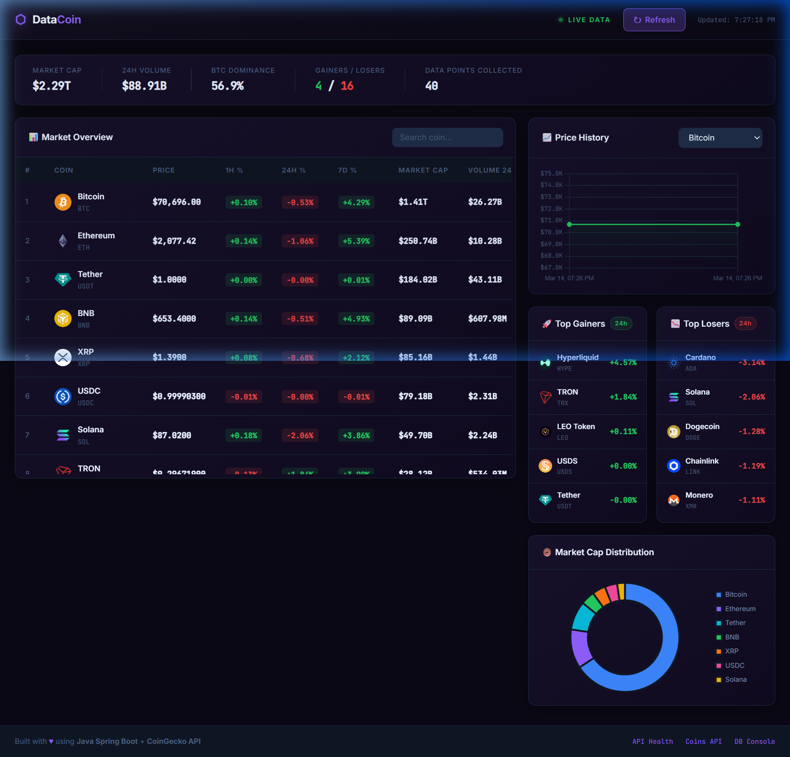
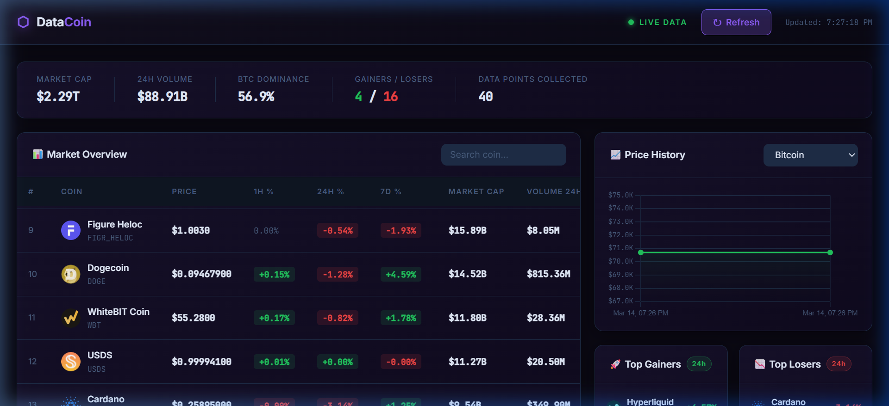
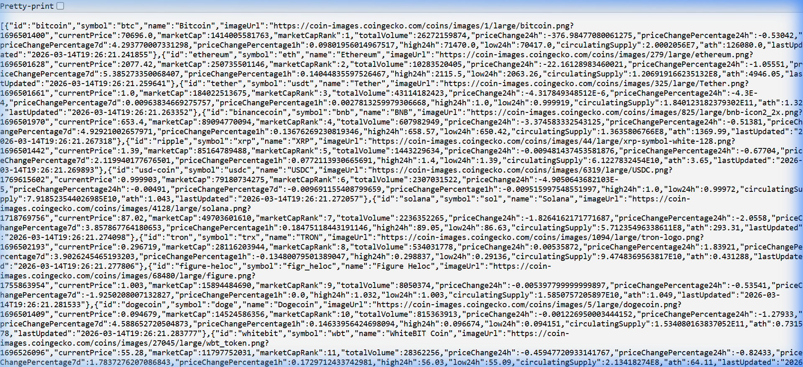
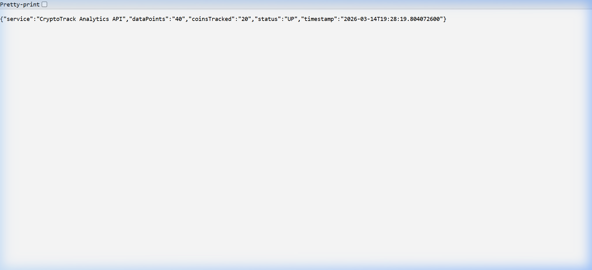
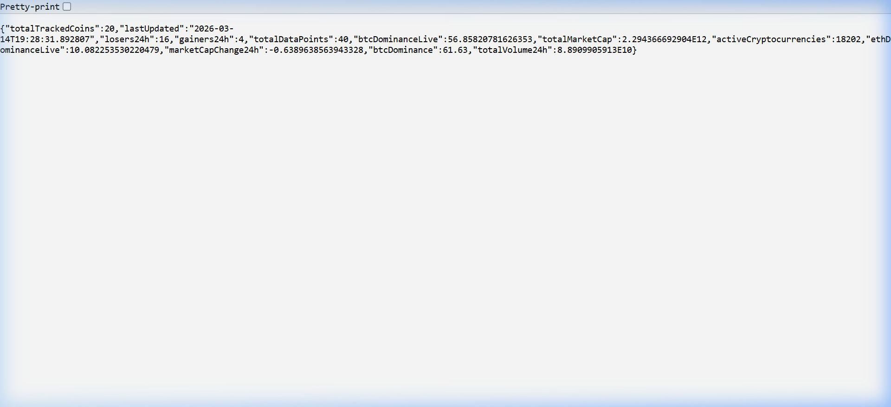
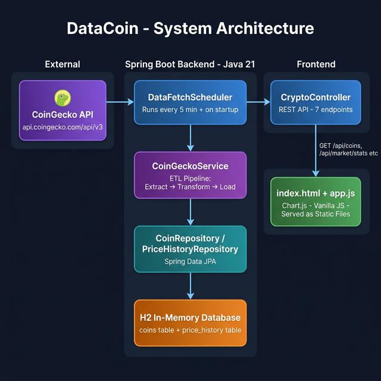

# ⬡ DataCoin — Real-Time Crypto Analytics Dashboard

> A full-stack data engineering project built with **Java Spring Boot** and **CoinGecko API** that fetches, stores, and visualizes live cryptocurrency market data.



---

## 📋 Table of Contents

1. [What is This Project?](#-what-is-this-project)
2. [What Does It Look Like?](#-what-does-it-look-like)
3. [The CoinGecko API — What Is It and How Did We Use It?](#-the-coingecko-api--what-is-it-and-how-did-we-use-it)
4. [How the Project Works (Architecture)](#-how-the-project-works-architecture)
5. [Project File Structure](#-project-file-structure)
6. [Tech Stack](#-tech-stack)
7. [How to Run the Project](#-how-to-run-the-project)
8. [API Endpoints Reference](#-api-endpoints-reference)
9. [The Database](#-the-database)
10. [Deployment Guide](#-deployment-guide)
11. [Why NOT Vercel?](#-why-not-vercel)

---

## 🤔 What is This Project?

**DataCoin** is a real-time cryptocurrency dashboard. Think of it like a personal mini-version of CoinMarketCap.

Here's what it does, in simple terms:

1. Every **5 minutes**, the app automatically goes to the internet and asks CoinGecko: *"Hey, what are the current prices of the top 20 cryptocurrencies?"*
2. CoinGecko responds with all that data (price, market cap, volume, % change, etc.)
3. The app **stores** all that data in its own local database
4. The **dashboard** (the website you open in your browser) reads from that database and shows you everything in a beautiful visual interface — tables, charts, graphs

This is what's called an **ETL Pipeline** in data engineering:
- **E**xtract → Get data from CoinGecko
- **T**ransform → Clean and format the data
- **L**oad → Save it to our database

---

## 📸 What Does It Look Like?

### Full Dashboard View
The main dashboard showing the market overview table, live stats banner, and charts all in one view.


### Scrolled View — Charts & Rankings
The price history chart (Bitcoin by default), Top Gainers, Top Losers, and the Market Cap donut chart.



### The Raw API Data — What the Backend Returns
When you visit `/api/coins` directly, you can see the raw JSON data that the backend returns. This is what the frontend reads to draw the charts and table.



### Health Check Endpoint
A quick health endpoint that tells you the app is `UP` and how many coins/data points are tracked.



### Market Statistics Endpoint
Shows live global market stats: total market cap, BTC dominance, number of gainers vs losers, etc.



---

## 🌐 The CoinGecko API — What Is It and How Did We Use It?

### What is an API?

Imagine a waiter at a restaurant. You (the customer) can't go into the kitchen yourself, but you give the waiter your order, and the waiter brings you your food. That's what an API (Application Programming Interface) does — it's the "waiter" between you and some data source.

**CoinGecko** is a website that tracks cryptocurrency prices. They provide a **free public API** — meaning anyone can ask them for crypto data over the internet, no credit card needed.

### What Endpoints Do We Use?

We call two URLs from CoinGecko:

#### 1. `/coins/markets` — Get top 20 coins
```
GET https://api.coingecko.com/api/v3/coins/markets
    ?vs_currency=usd
    &order=market_cap_desc
    &per_page=20
    &page=1
    &price_change_percentage=1h,24h,7d
```

This returns a list of 20 coins, each containing:
| Field | Meaning |
|---|---|
| `id` | Unique identifier e.g. `"bitcoin"` |
| `symbol` | Ticker e.g. `"btc"` |
| `name` | Full name e.g. `"Bitcoin"` |
| `current_price` | Price in USD e.g. `70696.0` |
| `market_cap` | Total market value in USD |
| `total_volume` | 24h trading volume |
| `price_change_percentage_24h` | % change in last 24h |
| `price_change_percentage_1h` | % change in last 1 hour |
| `price_change_percentage_7d` | % change in last 7 days |
| `ath` | All-time high price |
| `image` | URL to the coin's logo image |

#### 2. `/global` — Get global market stats
```
GET https://api.coingecko.com/api/v3/global
```

Returns overall market metrics like BTC dominance, total market cap across all coins, number of active cryptocurrencies worldwide.

### How Did We "Put It" In The Project?

In Java, we use a class called `RestTemplate` to make HTTP calls (like a browser sending a request). Here's how it works step-by-step:

```java
// 1. Build the URL
String url = "https://api.coingecko.com/api/v3/coins/markets?vs_currency=usd&...";

// 2. Set headers (identify our app to CoinGecko)
HttpHeaders headers = new HttpHeaders();
headers.set("User-Agent", "CryptoTrack-Analytics/1.0");

// 3. Make the HTTP GET request
ResponseEntity<List<CoinGeckoDTO.MarketCoin>> response = restTemplate.exchange(
    url,
    HttpMethod.GET,
    new HttpEntity<>(headers),
    new ParameterizedTypeReference<List<CoinGeckoDTO.MarketCoin>>() {}
);

// 4. Get the list of coins from the response
List<CoinGeckoDTO.MarketCoin> coins = response.getBody();
```

CoinGecko's free tier allows **~30 requests per minute**, and we only call it **every 5 minutes**, so we never hit any limit.

---

## 🏗️ How the Project Works (Architecture)

Here's the full picture of how all the pieces connect:



### The Flow, Step by Step:

```
[CoinGecko API]  ──→  [DataFetchScheduler]  ──→  [CoinGeckoService]
                                                        │
                                              ┌─────────┴──────────┐
                                     EXTRACT: Call CoinGecko API
                                     TRANSFORM: Map data to our Coin objects
                                     LOAD: Save to H2 Database
                                              └─────────┬──────────┘
                                                        │
                                              [H2 Database]
                                              ┌──────────────────┐
                                              │  coins table     │
                                              │  price_history   │
                                              └──────────────────┘
                                                        │
                                              [CryptoController]
                                              REST API endpoints
                                                        │
                                              [Frontend Dashboard]
                                              index.html + app.js
```

### The Scheduler — The "Heartbeat"

The `DataFetchScheduler` is like an alarm clock. It runs automatically:
- **Once on startup**: So you have data the second the app starts
- **Every 5 minutes**: To keep data fresh

```java
@PostConstruct              // ← runs once when app starts
public void runOnStartup() {
    coinGeckoService.fetchAndStoreMarketData();
}

@Scheduled(fixedDelayString = "${scheduler.fetch-interval}")  // ← runs every 5 min
public void scheduledFetch() {
    coinGeckoService.fetchAndStoreMarketData();
}
```

### The REST API — The "Menu"

The `CryptoController` is a list of URLs your browser (or any app) can call to get data. Think of it like a menu at a restaurant — each URL is a "dish" that returns different data.

---

## 📁 Project File Structure

```
cryptotrack/
├── pom.xml                          ← Maven build config (= package.json for Java)
├── README.md                        ← This file!
├── docs/
│   └── screenshots/                 ← All screenshots used in this README
└── src/
    └── main/
        ├── java/com/cryptotrack/
        │   ├── CryptotrackApplication.java     ← App entry point (main method)
        │   │
        │   ├── controller/
        │   │   └── CryptoController.java       ← REST API endpoints (7 endpoints)
        │   │
        │   ├── service/
        │   │   └── CoinGeckoService.java       ← ETL pipeline (fetches + stores data)
        │   │
        │   ├── scheduler/
        │   │   └── DataFetchScheduler.java     ← Auto-runs every 5 minutes
        │   │
        │   ├── model/
        │   │   ├── Coin.java                   ← Database table: "coins"
        │   │   └── PriceHistory.java           ← Database table: "price_history"
        │   │
        │   ├── repository/
        │   │   ├── CoinRepository.java         ← Database queries for coins
        │   │   └── PriceHistoryRepository.java ← Database queries for history
        │   │
        │   └── dto/
        │       └── CoinGeckoDTO.java           ← Blueprints matching CoinGecko's JSON
        │
        └── resources/
            ├── application.properties          ← App configuration (port, DB, API URL)
            └── static/
                ├── index.html                  ← The dashboard webpage
                ├── css/
                │   └── style.css              ← All the styling
                └── js/
                    └── app.js                 ← Frontend logic (charts, table, fetch)
```

### What Each File Does (Simple Explanation)

| File | What It Does |
|---|---|
| `CryptotrackApplication.java` | The "on" button. Starts the whole application. |
| `CoinGeckoService.java` | The worker. Goes to CoinGecko, gets data, saves it. |
| `DataFetchScheduler.java` | The timer. Tells the worker to run every 5 minutes. |
| `CryptoController.java` | The API menu. Defines all the URLs the frontend can call. |
| `Coin.java` | The blueprint for what a "coin" looks like in our database. |
| `PriceHistory.java` | Blueprint for storing historical price snapshots. |
| `CoinRepository.java` | Pre-made database search functions (find by rank, find gainers...). |
| `PriceHistoryRepository.java` | Pre-made database functions for price history over time. |
| `CoinGeckoDTO.java` | A "translation dictionary" — matches CoinGecko's JSON keys exactly. |
| `application.properties` | Settings file: which port to use, database config, API URL. |
| `index.html` | The webpage you see in your browser. |
| `app.js` | JavaScript that calls our API and draws the charts/table. |
| `style.css` | Makes everything look beautiful and dark. |

---

## 🛠️ Tech Stack

| Layer | Technology | Why |
|---|---|---|
| **Language** | Java 21 | Modern, fast LTS version |
| **Framework** | Spring Boot 3.2.3 | Industry standard for Java web apps |
| **Database** | H2 (in-memory) | Zero setup needed — perfect for dev |
| **ORM** | Spring Data JPA / Hibernate | Maps Java objects to database tables automatically |
| **HTTP Client** | RestTemplate | Built into Spring — makes API calls easy |
| **Scheduler** | Spring `@Scheduled` | Built-in task scheduling, no extra dependencies |
| **Frontend** | HTML + Vanilla JS | Simple, no framework needed |
| **Charts** | Chart.js (CDN) | Beautiful interactive charts with minimal code |
| **Fonts** | Google Fonts (Inter + JetBrains Mono) | Clean, modern, developer-style typography |
| **Data Source** | CoinGecko API (free tier) | No API key required, reliable, comprehensive |

---

## 🚀 How to Run the Project

### Prerequisites (What You Need Installed)

Before running this project, you need:

1. **Java 21** — [Download here](https://adoptium.net/)
   - To check if you have it: open a terminal and type `java -version`
   - You should see something like `openjdk version "21.x.x"`

2. **Maven** — [Download here](https://maven.apache.org/download.cgi)
   - To check: `mvn -version`
   - You should see `Apache Maven 3.x.x`

3. **Internet connection** — The app needs to reach CoinGecko API

That's it! No database to install. No Node.js. No extra tools.

---

### Step-by-Step: Running the App

#### Step 1 — Clone or Download the Project

If you have it from GitHub:
```bash
git clone https://github.com/YOUR_USERNAME/datacoin.git
cd datacoin
```

If you already have the folder, just navigate into it:
```bash
cd "c:\Users\MYC\Pictures\project data\P1\cryptotrack"
```

#### Step 2 — Run the Application

```bash
mvn spring-boot:run
```

That's the only command you need! Maven will:
1. Download all dependencies automatically (first time takes ~2 minutes)
2. Compile the Java code
3. Start the server on port 8080
4. Immediately fetch data from CoinGecko on startup

You'll see output like this in the terminal:
```
[Scheduler] Application started. Running initial data fetch...
[CoinGecko] Starting data fetch at 2026-03-14T19:26:19
[CoinGecko] Fetched 20 coins.
[CoinGecko] ✓ Data pipeline complete. 20 coins updated.
[Scheduler] Initial fetch complete at 2026-03-14T19:26:22
```

#### Step 3 — Open the Dashboard

Open your browser and go to:
```
http://localhost:8080
```

🎉 The dashboard will load with live cryptocurrency data!

---

### Other Useful Commands

| Command | What It Does |
|---|---|
| `mvn spring-boot:run` | Start the app in development mode |
| `mvn clean package` | Build a deployable `.jar` file |
| `mvn test` | Run the unit tests |
| `mvn clean` | Delete compiled files |

---

### Configuration

All settings live in `src/main/resources/application.properties`:

```properties
# Which port to run on (change this if 8080 is taken)
server.port=8080

# How often to fetch new data (in milliseconds)
# 300000 ms = 5 minutes
scheduler.fetch-interval=300000

# CoinGecko API base URL
coingecko.api.base-url=https://api.coingecko.com/api/v3
```

To change the refresh interval to 10 minutes, set:
```properties
scheduler.fetch-interval=600000
```

---

## 📡 API Endpoints Reference

Your Spring Boot backend exposes these endpoints. You can test them in your browser:

| Method | URL | What It Returns |
|---|---|---|
| `GET` | `/api/coins` | All 20 tracked coins with current prices |
| `GET` | `/api/coins/{id}` | Details for one coin (e.g. `/api/coins/bitcoin`) |
| `GET` | `/api/coins/{id}/history?days=7` | Price history for charting |
| `GET` | `/api/market/stats` | Global stats: total market cap, BTC dominance, etc. |
| `GET` | `/api/market/gainers` | Top 5 coins with biggest 24h gain |
| `GET` | `/api/market/losers` | Top 5 coins with biggest 24h loss |
| `POST` | `/api/refresh` | Manually trigger a data refresh right now |
| `GET` | `/api/health` | App health check (is it running?) |

### Example API Responses

**`GET /api/health`**
```json
{
  "status": "UP",
  "service": "CryptoTrack Analytics API",
  "coinsTracked": "20",
  "dataPoints": "40",
  "timestamp": "2026-03-14T19:28:19"
}
```

**`GET /api/market/stats`**
```json
{
  "totalTrackedCoins": 20,
  "totalMarketCap": 2294366692904,
  "totalVolume24h": 88909905913,
  "btcDominance": 61.63,
  "btcDominanceLive": 56.85,
  "gainers24h": 4,
  "losers24h": 16,
  "totalDataPoints": 40,
  "activeCryptocurrencies": 18202
}
```

**`GET /api/coins/bitcoin`**
```json
{
  "id": "bitcoin",
  "symbol": "btc",
  "name": "Bitcoin",
  "currentPrice": 70696.0,
  "marketCap": 1414005581763,
  "marketCapRank": 1,
  "priceChangePercentage24h": -0.53,
  "priceChangePercentage7d": 4.29,
  "ath": 126080.0
}
```

---

## 🗄️ The Database

We use **H2** — an in-memory database. Think of it like a spreadsheet that lives in RAM:
- ✅ No installation required
- ✅ Starts automatically with the app
- ✅ Great for development and demo purposes
- ⚠️ Data is lost when the app restarts (it re-fetches from CoinGecko on startup anyway)

### The Two Tables

**`coins` table** — stores the latest data for each coin:
```
id (PK)   | symbol | name    | current_price | market_cap     | market_cap_rank | ...
----------|--------|---------|---------------|----------------|-----------------|----
bitcoin   | btc    | Bitcoin | 70696.0       | 1414005581763  | 1               | ...
ethereum  | eth    | Ethereum| 2077.42       | 250735501146   | 2               | ...
...
```

**`price_history` table** — stores a new price snapshot every 5 minutes:
```
id  | coin_id  | coin_name | price    | recorded_at
----|----------|-----------|----------|---------------------
1   | bitcoin  | Bitcoin   | 70696.0  | 2026-03-14 19:26:21
2   | ethereum | Ethereum  | 2077.42  | 2026-03-14 19:26:21
...
41  | bitcoin  | Bitcoin   | 70720.0  | 2026-03-14 19:31:22   ← 5 min later
```

This is what powers the **price history charts**!

### Access the Database Console

While the app is running, open:
```
http://localhost:8080/h2-console
```

Login with:
- **JDBC URL**: `jdbc:h2:mem:cryptotrackdb`
- **Username**: `sa`
- **Password**: *(leave empty)*

You can run SQL queries like:
```sql
SELECT * FROM coins ORDER BY market_cap_rank;
SELECT COUNT(*) FROM price_history;
SELECT * FROM price_history WHERE coin_id = 'bitcoin' ORDER BY recorded_at DESC LIMIT 10;
```

---

## 🌍 Deployment Guide

### ⚠️ Why NOT Vercel?

This is important: **Vercel does NOT support Java/Spring Boot applications.**

Vercel is designed for frontend websites and serverless functions in JavaScript/Python/Go. It cannot run a Java Spring Boot server. If you try to deploy this on Vercel, it will simply not work.

Here's a clear comparison:

| Platform | Good For | Supports Java? | Free Tier? |
|---|---|---|---|
| **Vercel** | React, Next.js, static sites | ❌ No | ✅ Yes |
| **Railway** | Any app with a server | ✅ Yes | ✅ Yes ($5 credit) |
| **Render** | Any app with a server | ✅ Yes | ✅ Yes (free tier) |
| **Fly.io** | Dockerized apps | ✅ Yes | ✅ Yes |
| **Heroku** | Any server app | ✅ Yes | ❌ Paid only |

### ✅ Recommended: Deploy on Railway (Easiest)

[Railway](https://railway.app) is the simplest platform for Spring Boot apps. It detects Java projects automatically.

#### Step 1 — Push to GitHub First

```bash
# In your project folder
git init
git add .
git commit -m "Initial commit: DataCoin crypto dashboard"
git remote add origin https://github.com/YOUR_USERNAME/datacoin.git
git push -u origin main
```

Make sure your `.gitignore` contains:
```
target/
.mvn/
*.class
*.jar
*.war
```

#### Step 2 — Deploy on Railway

1. Go to [railway.app](https://railway.app) and sign up with GitHub
2. Click **"New Project"** → **"Deploy from GitHub repo"**
3. Select your `datacoin` repository
4. Railway will automatically detect it's a Java Maven project
5. It builds and deploys! 🎉

#### Step 3 — Set Environment Variables (Optional)

In Railway dashboard → your service → **Variables**, you can set:
```
SCHEDULER_FETCH_INTERVAL=300000
SERVER_PORT=8080
```

#### Step 4 — Your App is Live!

Railway gives you a public URL like:
```
https://datacoin-production.up.railway.app
```

You can paste this link on your portfolio!

---

### Alternative: Deploy on Render

1. Go to [render.com](https://render.com) → **New** → **Web Service**
2. Connect your GitHub repo
3. Set:
   - **Build Command**: `mvn clean package -DskipTests`
   - **Start Command**: `java -jar target/cryptotrack-0.0.1-SNAPSHOT.jar`
4. Deploy!

---

### ⚠️ Important Note About H2 In-Memory Database

When deployed, the app uses an H2 **in-memory** database. This means:
- Every time the app **restarts** on the server, it loses its history data
- But it **immediately re-fetches** fresh data from CoinGecko on startup
- For a portfolio project, this is totally fine!

If you ever want persistent data (data that survives restarts), you'd switch to **PostgreSQL** — both Railway and Render offer free PostgreSQL databases you can connect.

---

## 🔗 Links

- **CoinGecko API Docs**: https://www.coingecko.com/en/api/documentation
- **Spring Boot Docs**: https://spring.io/projects/spring-boot
- **Railway Deployment**: https://railway.app
- **Chart.js Docs**: https://www.chartjs.org/docs/latest/

---

## 👤 FARAH KHATTABI

Built as a data engineering portfolio project demonstrating:
- RESTful API design with Spring Boot
- ETL pipeline architecture
- Time-series data collection and storage
- Real-time data visualization with Chart.js
- Scheduled background tasks

---

*Data provided by [CoinGecko](https://www.coingecko.com) — free public API, no key required.*
